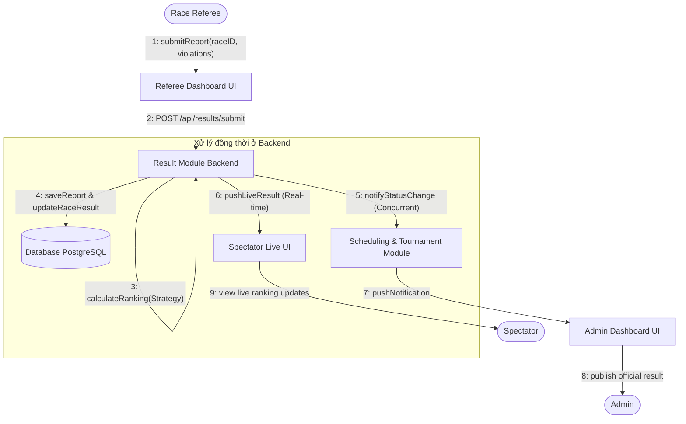
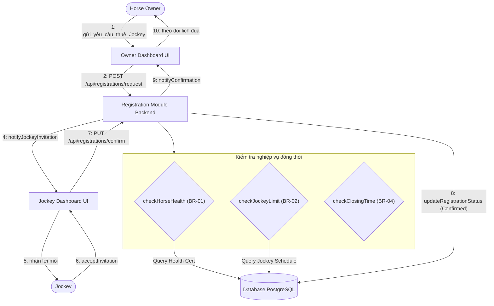
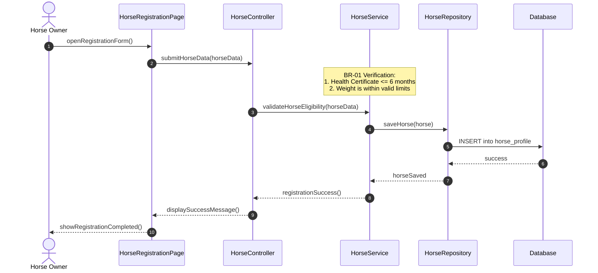
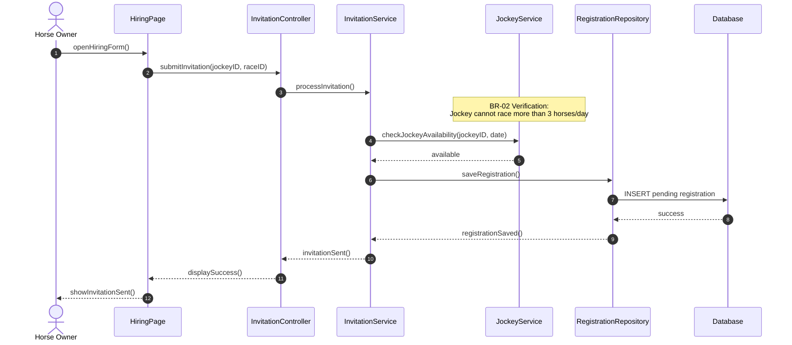
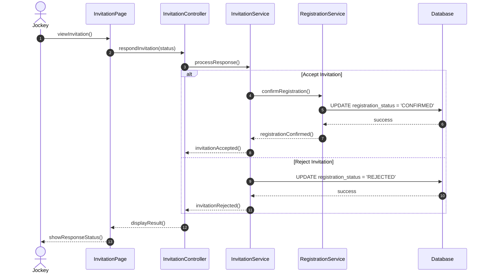
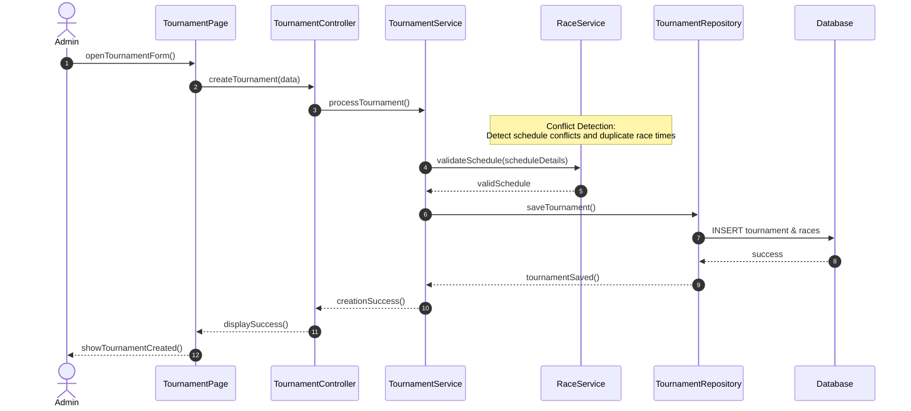
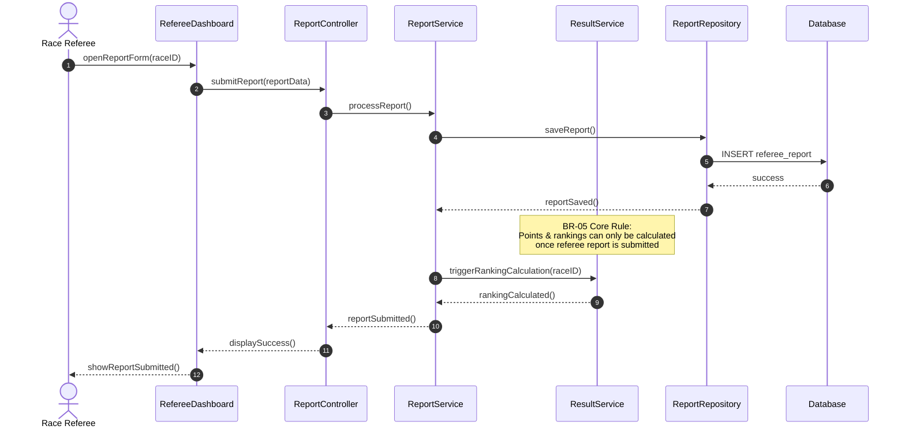
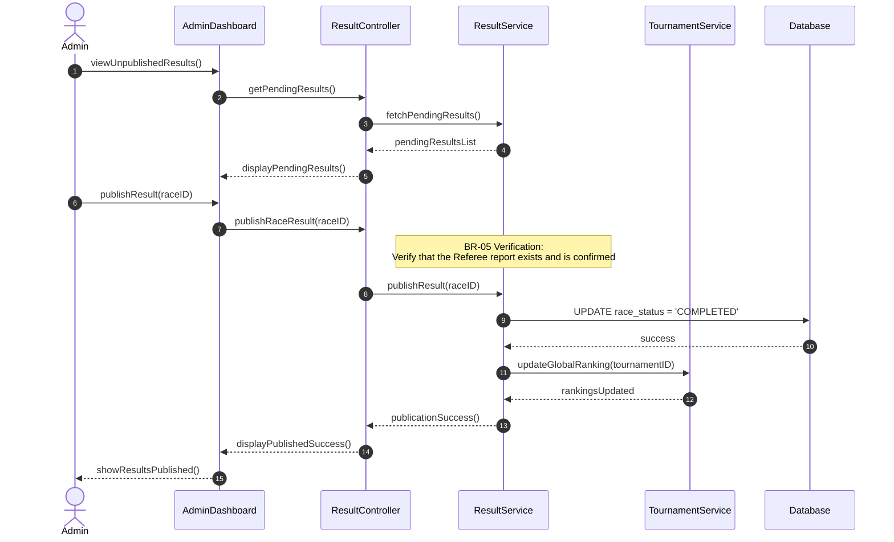
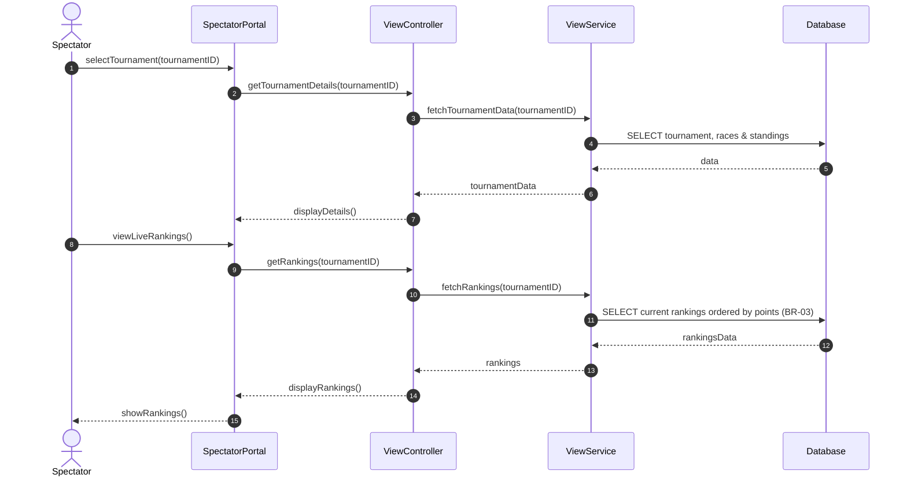

# HƯỚNG DẪN NGHIỆP VỤ & SƠ ĐỒ LUỒNG HOẠT ĐỘNG (BUSINESS FLOWS)
## Hệ thống quản lý giải đua ngựa (Horse Racing Tournament Management System)

Tài liệu này hệ thống hóa toàn bộ các luồng nghiệp vụ cốt lõi và các quy tắc nghiệp vụ (Business Rules - BR) của dự án Horse Racing Tournament Management System (MVP) dưới dạng sơ đồ **Mermaid** trực quan.

> [!NOTE]
> Các sơ đồ thiết kế tổng thể bao gồm Sơ đồ Use Case, Sơ đồ cấu trúc thành phần (Component View) và Sơ đồ lớp (Class Diagram) đã được chuyển sang tài liệu đặc tả [SRS_Horse_Racing_Tournament_Management_System.md](file:///c:/Users/PC%202024/Desktop/IdeaProjects/swd/HorseRace/doc/docs/SRS_Horse_Racing_Tournament_Management_System.md).

---

## 1. Sơ đồ tương tác đồng thời (Concurrent Communication Diagrams)

Các luồng xử lý đồng thời, kiểm tra ràng buộc nghiệp vụ (Business Rules) và đồng bộ hóa trạng thái giữa cơ sở dữ liệu và các thành phần giao diện người dùng.

### 1.1. Quy trình nộp báo cáo kết quả của Trọng tài (Referee's Result Flow)

### 1.2. Quy trình đăng ký và kết nối Jockey của Chủ ngựa (Jockey's Registration Flow)

---

## 2. Sơ đồ tuần tự các luồng nghiệp vụ chi tiết (Sequence Diagrams)

### Luồng 2.1: Đăng ký hồ sơ ngựa mới (Horse Owner Register Horse)
*Mô tả:* Chủ ngựa đăng ký thông tin cho ngựa tham gia hệ thống, bắt buộc kiểm tra điều kiện sức khỏe và hạng cân theo quy tắc **BR-01**.

### Luồng 2.2: Gửi yêu cầu thuê Jockey (Horse Owner Hire Jockey)
*Mô tả:* Chủ ngựa gửi lời mời cho Jockey điều khiển ngựa. Hệ thống kiểm tra xem Jockey đó đã đạt giới hạn cuộc đua trong ngày hay chưa theo quy tắc **BR-02**.

### Luồng 2.3: Jockey phản hồi lời mời thuê (Jockey Accept / Reject Invitation)
*Mô tả:* Jockey xem lời mời và tiến hành chấp nhận hoặc từ chối. Trạng thái đăng ký giải đấu chỉ được xác nhận chính thức khi Jockey đồng ý.

### Luồng 2.4: Lập lịch giải đấu & vòng đua mới (Admin Create Tournament)
*Mô tả:* Admin tạo giải đấu và phân bổ các vòng đua. Hệ thống tự động kiểm tra xung đột về mặt thời gian và địa điểm đua để tránh chồng chéo lịch trình.

### Luồng 2.5: Trọng tài nộp biên bản thi đấu (Race Referee Submit Race Report)
*Mô tả:* Trọng tài kiểm tra ngựa, ghi nhận các lỗi vi phạm trong trận đua và gửi biên bản lên hệ thống để kích hoạt việc tính toán điểm số.

### Luồng 2.6: Admin công bố kết quả chính thức (Admin Publish Result)
*Mô tả:* Admin tiến hành kiểm duyệt kết quả và phát hành chính thức lên bảng tin của khán giả. Luồng này thực thi chặt chẽ quy tắc **BR-05** (không thể công bố trước khi có biên bản của trọng tài).

### Luồng 2.7: Khán giả tra cứu bảng xếp hạng (Spectator View Result & Rankings)
*Mô tả:* Khán giả (Spectator) truy cập hệ thống để xem trực tuyến lịch đua, kết quả xếp hạng và điểm số của từng ngựa đua/jockey theo thời gian thực.

---

## 3. Tổng hợp quy tắc nghiệp vụ áp dụng trong các luồng (Business Rules Mapping)

| Mã Quy Tắc (BR) | Loại Quy Tắc | Nội Dung Ràng Buộc | Module Xử Lý | Vị Trí Kiểm Tra Trong Luồng |
| :--- | :--- | :--- | :--- | :--- |
| **BR-01** | Định nghĩa (Definitional) | Ngựa phải có chứng nhận sức khỏe $\le 6$ tháng và cân nặng nằm trong hạng cân cho phép. | `registrationModule` | Luồng 2.1 (Bước 3) & Luồng 1.2 |
| **BR-02** | Hành vi (Behavioral) | Một Jockey không được đua quá 3 lượt trong cùng một ngày. | `judgingModule` | Luồng 2.2 (Bước 4) & Luồng 1.2 |
| **BR-03** | Tính toán (Calculational) | Điểm số xếp hạng tính bằng: $\sum (\text{Thời gian hoàn thành} \times \text{Hệ số quãng đường})$. Xử lý hòa bằng cách xét thời gian chạy nhanh nhất ở các vòng. | `tournamentModule` | Luồng 2.7 (Bước 9) & Luồng 1.1 |
| **BR-04** | Thời gian (Temporal) | Cổng đăng ký tự động đóng trước thời điểm đua 48 giờ. | `registrationModule` | Luồng 1.2 (Bước 3) |
| **BR-05** | Hành vi (Behavioral) | Kết quả chỉ chính thức khi có biên bản từ trọng tài và được Admin duyệt công bố. | `judgingModule` | Luồng 2.5 (Bước 7) & Luồng 2.6 (Bước 8) |
