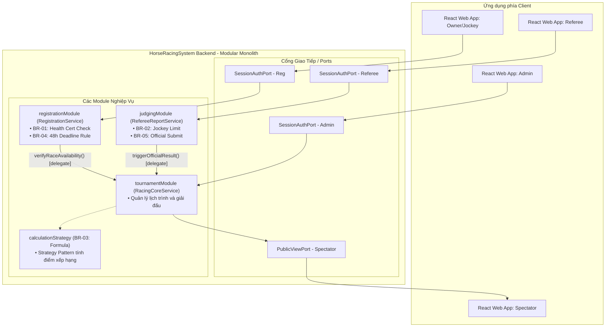
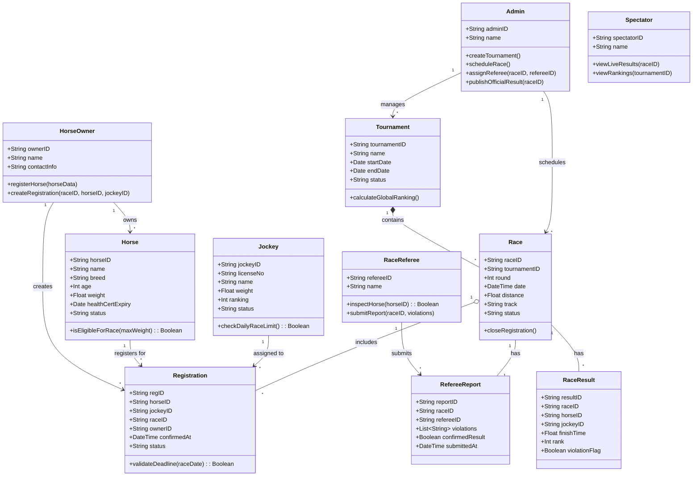

# TÀI LIỆU YÊU CẦU PHẦN MỀM (SRS)

## Dự án: Hệ thống quản lý giải đua ngựa (Horse Racing Tournament Management System)

**Mã Topic:** SU26SWP02
**Kỳ học:** Summer 2026

---

# 1. Giới Thiệu (Introduction)

## 1.1 Mục đích

Tài liệu này mô tả các yêu cầu kỹ thuật và nghiệp vụ cho Hệ thống quản lý giải đua ngựa dành cho môn học SWR303.

Dự án được thiết kế theo tư duy **MVP (Minimum Viable Product)** nhằm phù hợp với nguồn lực của nhóm 5 thành viên thực hiện trong thời gian 6 tuần.

## 1.2 Phạm vi hệ thống (In Scope)

* Quản lý hồ sơ ngựa và jockey (người cưỡi ngựa).
* Lập lịch giải đấu và các vòng đua.
* Phân công trọng tài và quản lý biên bản thi đấu.
* Ghi nhận kết quả và tính điểm xếp hạng tự động.
* Khán giả xem lịch thi đấu và kết quả trực tiếp.

## 1.3 Ngoài phạm vi (Out of Scope)

Các chức năng sau không nằm trong phạm vi của phiên bản MVP:

* Tích hợp cá cược ăn tiền thật.
* Tích hợp phần cứng IoT đo thời gian.
* Streaming video trực tiếp.
* Ứng dụng Mobile (chỉ phát triển Web Portal).

### Tạm hoãn (Phase 2)

* Hệ thống dự đoán (Prediction).
* Hệ thống trả thưởng cho khán giả.

---

# 2. Bối Cảnh & Vấn Đề (Context & Problem Statement)

Hiện tại, quá trình tổ chức giải đua ngựa đang gặp nhiều khó khăn do việc quản lý còn mang tính thủ công và phân mảnh:

* Đăng ký bằng giấy tờ dễ gây trùng lặp hồ sơ ngựa và jockey.
* Lịch thi đấu được quản lý bằng Excel và không tự động phát hiện xung đột lịch.
* Khán giả không thể tiếp cận kết quả theo thời gian thực (real-time).
* Trọng tài nộp báo cáo thủ công, thiếu quy trình theo dõi và ghi nhận vi phạm chuẩn hóa.

---

# 3. Yêu Cầu Chức Năng (Functional Requirements)

## 3.1 Danh sách chức năng theo vai trò

| Role         | Functionality                                                   |
| ------------ | --------------------------------------------------------------- |
| Admin        | Quản lý tài khoản và phân quyền người dùng trong hệ thống       |
| Admin        | Tạo và quản lý giải đấu (thêm vòng đua, chốt danh sách thi đấu) |
| Admin        | Duyệt hồ sơ ngựa tham gia và phân công Race Referee             |
| Admin        | Công bố kết quả thi đấu chính thức                              |
| Horse Owner  | Đăng ký tài khoản và quản lý hồ sơ ngựa                         |
| Horse Owner  | Gửi yêu cầu thuê Jockey cho các cuộc đua                        |
| Horse Owner  | Xác nhận tham gia giải đấu và theo dõi lịch/kết quả             |
| Jockey       | Cập nhật hồ sơ và năng lực cá nhân                              |
| Jockey       | Xem, chấp nhận hoặc từ chối lời mời điều khiển ngựa             |
| Jockey       | Theo dõi lịch thi đấu và bảng xếp hạng cá nhân                  |
| Race Referee | Kiểm tra điều kiện của ngựa trước cuộc đua                      |
| Race Referee | Ghi nhận lỗi vi phạm trong quá trình đua                        |
| Race Referee | Lập biên bản thi đấu và gửi kết quả lên hệ thống                |
| Spectator    | Đăng ký tài khoản                                               |
| Spectator    | Xem thông tin giải đấu, lịch đua và bảng xếp hạng trực tiếp     |

## 3.2 Sơ đồ Use Case (Use Case Diagram)

```mermaid
graph TD
  %% Actors Definition
  subgraph Actors [Tác nhân]
    A[Admin]
    O[Horse Owner]
    J[Jockey]
    R[Race Referee]
    S[Spectator]
  end

  %% Use Cases Definition
  subgraph System [Horse Racing System Boundary - MVP]
    %% Admin Use Cases
    UC_A1(Quản lý tài khoản & Phân quyền)
    UC_A2(Tạo & Quản lý giải đấu / Vòng đua)
    UC_A3(Duyệt hồ sơ ngựa & Phân công trọng tài)
    UC_A4(Công bố kết quả thi đấu chính thức)

    %% Owner Use Cases
    UC_O1(Quản lý hồ sơ ngựa)
    UC_O2(Thuê Jockey / Gửi & Phản hồi lời mời)
    UC_O3(Xác nhận tham gia giải đấu)

    %% Jockey Use Cases
    UC_J1(Cập nhật hồ sơ & Năng lực cá nhân)
    UC_J2(Xem & Quản lý lịch đua / Thành tích cá nhân)

    %% Referee Use Cases
    UC_R1(Kiểm tra & Xác nhận điều kiện ngựa trước đua - BR-01)
    UC_R2(Ghi nhận lỗi vi phạm trong trận đua)
    UC_R3(Lập biên bản thi đấu & Submit kết quả - BR-05)

    %% Spectator Use Cases
    UC_S1(Đăng ký tài khoản)
    UC_S2(Xem lịch đua, kết quả & Bảng xếp hạng trực tiếp)
  end

  %% Associations
  A --> UC_A1
  A --> UC_A2
  A --> UC_A3
  A --> UC_A4

  O --> UC_O1
  O --> UC_O2
  O --> UC_O3
  O --> UC_S2

  J --> UC_J1
  J --> UC_O2
  J --> UC_J2

  R --> UC_R1
  R --> UC_R2
  R --> UC_R3

  S --> UC_S1
  S --> UC_S2

  %% Relationships between Use Cases
  UC_A4 -.->|"<<include>> (BR-05)"| UC_R3
```



---

# 4. Yêu Cầu Phi Chức Năng & Kiến Trúc (Non-Functional Requirements)

## 4.1 Kiến trúc phần mềm

Sử dụng kiến trúc **Modular Monolith**.

Các module chính:

* Registration Module
* Scheduling Module
* Result Management Module

Ưu điểm:

* Dễ phát triển trong thời gian ngắn.
* Đơn giản hơn Microservices.
* Dễ bảo trì và mở rộng.

### Sơ đồ cấu trúc thành phần (Structured Component View)



## 4.2 Backend

Công nghệ đề xuất:

* Java hoặc Kotlin
* Spring Boot Framework

## 4.3 Design Principles

Áp dụng:

* SOLID Principles
* Design Patterns

Ví dụ:

* **Strategy Pattern** cho logic tính điểm và xếp hạng.

## 4.4 Bảo mật

Triển khai:

* Session-Based Authentication với HttpOnly Cookie

hoặc

* JWT Authentication

Mục tiêu:

* Bảo vệ tài khoản người dùng.
* Giảm nguy cơ tấn công phổ biến trên Web Portal.

## 4.5 Sơ đồ lớp (Class Diagram)



## 4.6 Deployment

Sử dụng:

* Docker

Triển khai trên:

* AWS EC2
* Render
* Heroku

Mục tiêu:

* Hỗ trợ Admin và Giảng viên truy cập đánh giá hệ thống.

---

> [!NOTE]
> Chi tiết toàn bộ luồng nghiệp vụ động (giao tiếp đồng thời & sơ đồ tuần tự sequence) được định nghĩa chi tiết tại tài liệu [bussiness_flow.md](file:///c:/Users/PC%202024/Desktop/IdeaProjects/swd/HorseRace/doc/bussiness_flow.md).


---

# 5. Quy Tắc Nghiệp Vụ (Business Rules)

## BR-01 [Definitional]

Ngựa phải có:

* Giấy chứng nhận sức khỏe còn hạn (≤ 6 tháng)
* Cân nặng không vượt quá giới hạn của hạng cân

thì mới đủ điều kiện tham gia thi đấu.

## BR-02 [Behavioral]

Một Jockey không được tham gia điều khiển quá **3 ngựa trong cùng một ngày**.

## BR-03 [Calculational]

Thứ hạng giải đấu được tính theo:

```text
Tổng điểm = Σ (Thời gian hoàn thành × Hệ số quãng đường)
```

Nếu hòa điểm:

* So sánh thời gian hoàn thành vòng đua nhanh nhất.

## BR-04 [Temporal]

Cổng đăng ký tự động đóng trước **48 giờ** so với thời điểm diễn ra cuộc đua.

Mọi đăng ký sau thời gian này sẽ bị hệ thống tự động từ chối.

## BR-05 [Behavioral]

Kết quả thi đấu chỉ được xem là **CHÍNH THỨC** khi:

1. Trọng tài đã nộp biên bản thi đấu.
2. Admin xác nhận và công bố kết quả.

Admin không được phép công bố kết quả trước khi biên bản được gửi lên hệ thống.

---

# 6. Kết Luận

Phiên bản MVP của hệ thống tập trung giải quyết các nghiệp vụ cốt lõi:

* Đăng ký tham gia giải đấu.
* Quản lý ngựa và jockey.
* Lập lịch thi đấu.
* Quản lý trọng tài.
* Ghi nhận kết quả và xếp hạng.
* Cung cấp thông tin trực tiếp cho khán giả.

Các chức năng nâng cao như dự đoán kết quả, cá cược và livestream sẽ được xem xét triển khai trong các giai đoạn tiếp theo.
